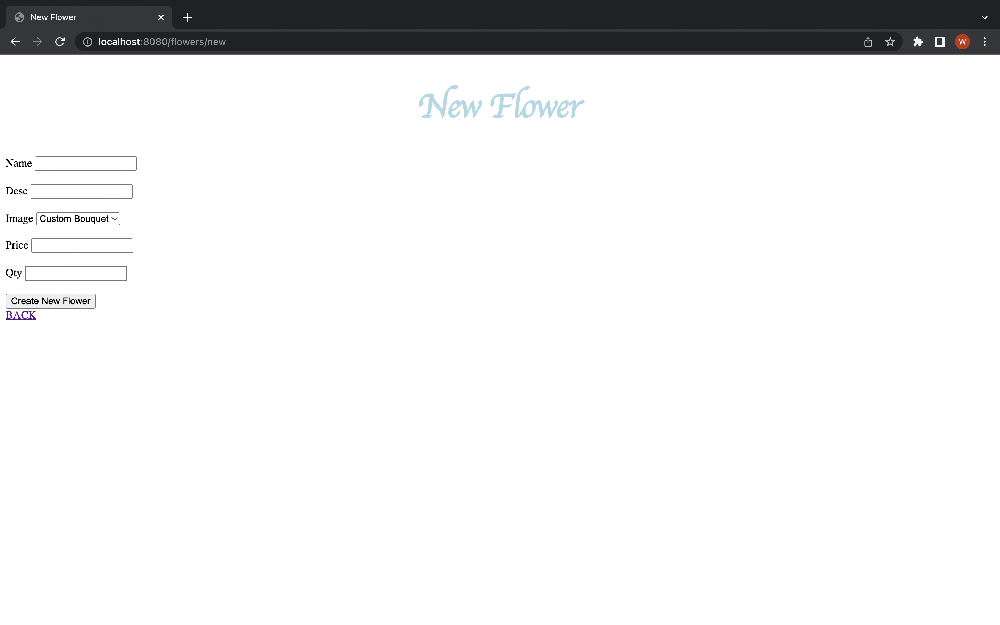

 ## Blue Orchid
 My Project is a simple website that uses CRUD. The goal of the website is to allow users to buy different flower bouquets. The goal is is to be able to update, delete, and buy flowers.

## Routes
 Get “/flowers” = > renders index view listing

Get “/flowers/types/new” = > renders new view with type schema in a form

Delete “/flowers/types/:id => find a product by ID and deletes from database

Put “/flowers/types/:id => update a product ID

Post “flowers/types” => add a product to the database

Get “/flowers/types/:id/edit” => render edit view with type schema to edit  

Get “/flowers/types” => render show view listing all types currently stored in database

 
## Model Schema

Const type = new schema  {(

name: { type: String, required: true, unique: true},
description: { type: String, required: true},
img: { type: String},
price: { type: number, required: true} ,
qty: { type: number, required: true} ,

})

## Tools Used
Javascript
Mongoose
Express
EJS
Node
CSS
HTML
MockFlow

## Screenshots 

## Wireframe

## Link to Website 
https://blue-orchid-flowers.herokuapp.com/

